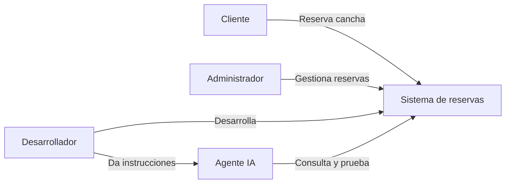
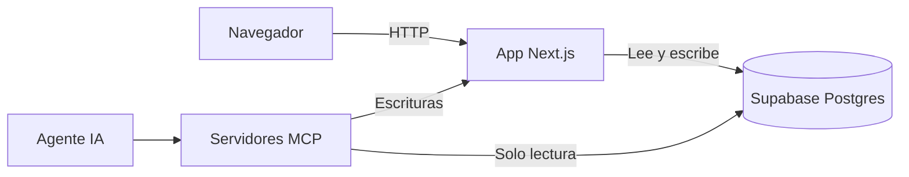

# Arquitectura

## 1. Contexto

Quién usa el sistema de reservas.

```mermaid
flowchart LR
    cliente["Cliente"]
    admin["Administrador"]
    dev["Desarrollador"]
    agente["Agente IA"]
    sistema["Sistema de reservas"]

    cliente -->|"Reserva cancha"| sistema
    admin -->|"Gestiona reservas"| sistema
    dev -->|"Da instrucciones"| agente
    dev -->|"Desarrolla"| sistema
    agente -->|"Consulta y prueba"| sistema
```

## 2. Contenedores

Piezas del sistema y cómo se conectan.

```mermaid
flowchart LR
    navegador["Navegador"]
    app["App Next.js"]
    db[("Supabase Postgres")]
    agente["Agente IA"]
    mcp["Servidores MCP"]

    navegador -->|"HTTP"| app
    app -->|"Lee y escribe"| db
    agente --> mcp
    mcp -->|"Solo lectura"| db
    mcp -->|"Escrituras"| app
```
